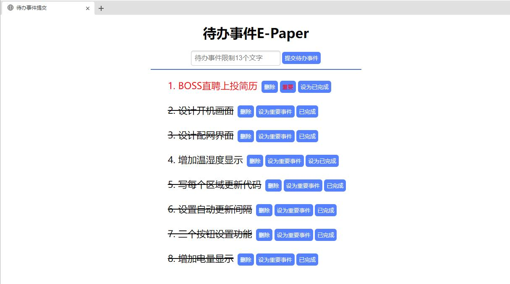
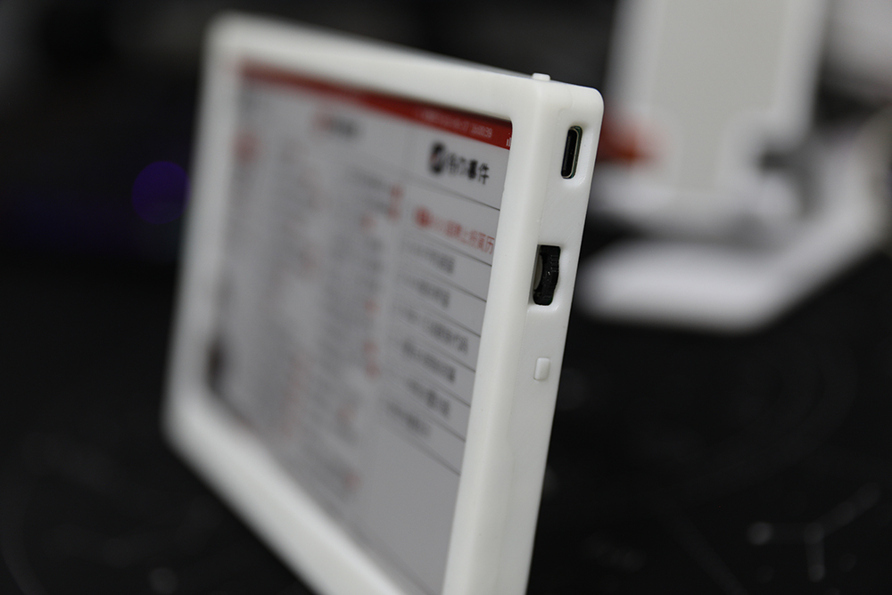
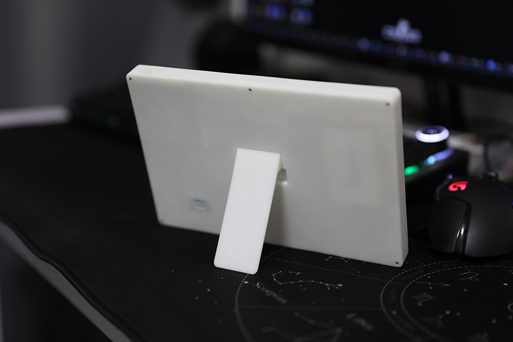
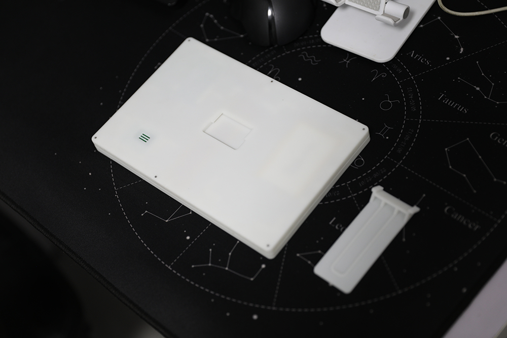

## 桌面多功能E-paper


### 项目简介
此项目使用ESP32驱动7.5寸三色墨水屏显示丰富的信息，如果感兴趣，请继续阅读，下文介绍如何使用此项目代码<br>
- **B站视频演示地址：[点击观看视频](https://www.bilibili.com/video/BV1Fo4y137n9/?vd_source=a935ffb91a0eac4e16a0461b0709faa9)**<br>
- <a target="_blank" href="https://qm.qq.com/cgi-bin/qm/qr?k=OCk2mwPC4yZn-BBJlH2ehWT-2sHfC7Os&jump_from=webapi&authKey=iFtohDmv6OI7O5aD/0ogd6mODvY5vr837fherj6ruuDCK94UM5KrjicZ2cFO5dHB"></a>QQ交流群：1051455459


### 需要的环境
- 一个远程服务器，需要安装LNMP环境，同时安装thinkPHP6.1
- 一个域名，用来转化各种api以及访问更新待办事件的上位机页面
- Arduino IDE

### 使用的硬件
- ESP32 WROVER开发板以及屏幕转接板 （闲鱼搜记得带马扎 可以购买现成pcb）
- 一块7.5寸三色墨水屏（使用GxEPD2_750c_Z08驱动）
- 3.7v锂电池

### 7.5inch_Multifunctional_E-Paper文件夹
- 此文件夹中包含驱动墨水屏主要代码，包含了获取天气日期微博热搜等数据代码以及显示代码，需要使用arduino编译，编译之前注意头文件引用的库，没有的需要单独安装。<br>

- 代码需要修改每个get***.ino文件中的api地址，例如  


``` python
http.begin(Client, "http://日期.php");
``` 

中需要修改http后面地址，修改为你自己实际的地址，例如http://yoursite.com/time.php  

### html文件夹
- 此文件中包含了提交待办事件的上位机网页，将此文件上传到服务器Nginx的网站目录，域名解析到此目录后用域名访问  
- 文件夹中需要修改db.php中的  

``` PHP
$conn = new mysqli('你的服务器数据库地址', 'root', '数据库密码', '数据表名');
``` 
- 可以成功访问后会看到下图所示页面  

- 页面中可以进行待办事件的添加、删除、标记为重要、取消重要、标记为已完成、标记为未完成等动作，每个动作都能实时同步到数据库中  

### PHP文件夹
- 此文件中包含了没有使用thinkPHP框架的PHP文件  
  - todo.sql需要上传到MySQL数据库中  
  - 一言的php对一言api进行了筛选优化，去掉了过于短或者过于长的句子，并给作者的前面加了破折号  
  - 微博的php对微博api进行了筛选，只保留了热点事件跟后面的label部分，并且限制到只获取34条微博热搜  
  - 宜忌的php限制了获取到的数据的字数，防止显示超出范围，php文件中的秘钥需要到https://market.topthink.com/my/api 网站申请

### thinkphp6文件夹
- 此文件中的php文件需要放到thinkPHP框架中  
  - 天气的php中需要修改秘钥，去和风天气api中申请即可  
  - 待办的php中需要修改数据库的地址、密码、以及使用的数据表名称  
  - 日期php不需要做特别修改  

### 墨水屏显示整个逻辑介绍
- 第一次上电或者更换无线网络环境后，开机后会首先显示开机画面，然后无线网连接失败会进入配网界面  
- 配网成功后等待片刻，会进入整个界面，所有数据分别获取然后统一刷新
- 整个墨水屏会两个小时全刷一次，每次刷新都卡在整点（由于没有局刷，所以目前是整个刷新）  
- 待办事件10秒钟会获取一次服务器的数据进行对比，如果有更新，会马上刷新墨水屏  
- 一言api每次刷新都会改变内容  
- 下方向按键按下后可以立马刷新墨水屏所有内容  

### 已知bug
- 第一次上电后右上角的刷新于后面的时间会更新错误，手动刷新一次即可（待完善）  


### 实物图效果展示
- 背面支架可拆卸，后期会设计上墙套件跟上冰箱磁吸套件





### 🌟制作不易，感谢支持🌟


